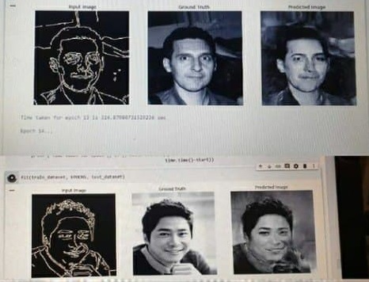

# Edge2Face-Translation
Implementation of cGAN for transforming edges to faces...

In this project I'm gonna implement a cGAN to translate edges into faces!

The codes are based on Pix2Pix implementation of **Image-to-Image Translation with Conditional Adversarial Networks** paper with minor changes. 

The dataset is prepared with a modification to the *celeba* dataset to make it like sketch. I've acutally, extracted the edges there.

After that, Pix2Pix is trained on the real/sketch pairs.

#  Results
After some epochs, it seems it has learned something. The first column is the input to the Pix2Pix, the second column is the ground truth, and the third one is the Pix2Pix output.

